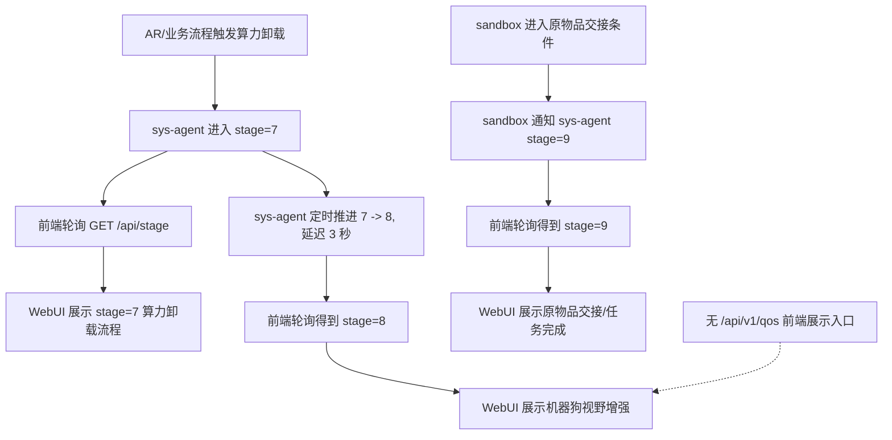
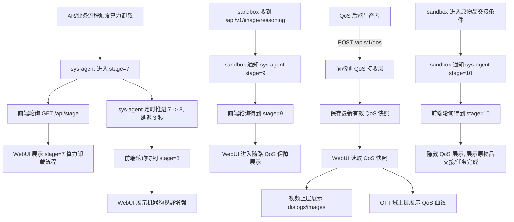
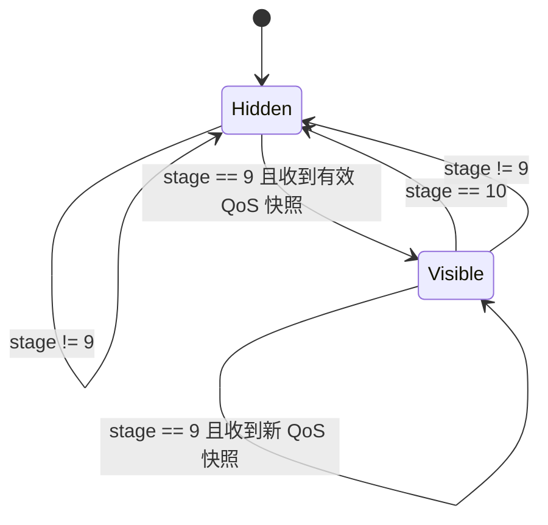

# Stage 9 随路 QoS 前端呈现设计

## 背景

当前 `compute-webui` 的演示阶段由 `/api/stage` 驱动，前端通过 `useStagePolling` 轮询阶段状态，再由 `STAGE_CONFIG`、`useEffectiveStageConfig`、`NetworkTopology3D` 和左侧视频面板共同完成展示。

现有 `stage=9` 表示“物品交接/任务完成”。新增需求要求插入一个新的 `stage=9`，表示“随路 QoS 保障用户体验”，并将原有 `stage=9` 整体顺延为 `stage=10`。

同时新增一个 QoS 数据入口：后端主动向前端侧 `POST /api/v1/qos`，请求体为 JSON，包含 `metrics`、`dialogs`、`images` 三个字段。前端在新 `stage=9` 展示 QoS 对话、图片和指标曲线，进入 `stage=10` 后清空并隐藏这些 QoS 展示。

## 目标

- 新增 `stage=9` 页面语义：随路 QoS 保障用户体验。
- 原有 `stage=9` 的物品交接/任务完成展示变为 `stage=10`。
- 前端侧支持接收 `POST /api/v1/qos` 的 JSON 数据。
- `dialogs` 和 `images` 按数组下标配对，以对话形式叠加在视频上方。
- 图片可通过配置显示在对应对话文本上方或下方。
- `metrics` 以 `timestamp` 为横轴，绘制 `sendrate_kbps` 和 `gbr_kbps` 两条曲线。
- QoS 图表显示在拓扑图 OTT 域上层，尺寸稳定，不挤压拓扑布局。
- 一旦进入 `stage=10`，QoS 对话、图片、图表都不再显示。

## 非目标

- 不在本设计中实现 sandbox 和 sys-agent 的后端逻辑，只描述前端对接要求。
- 不改变 WebRTC offer 流程。
- 不把 `q_lvl` 作为第一版图表主曲线；第一版保留并用于质量等级标识、颜色或提示。
- 不要求浏览器页面直接作为 HTTP 服务监听 POST。浏览器无法直接接收任意后端 HTTP POST，需要由前端仓的接收层或部署宿主接收后转给页面状态。

## 推荐方案

采用“QoS 接收层 + 页面读取最新 QoS 状态”的方案。

前端仓提供 `/api/v1/qos` 的接收契约：

- 后端生产者：`POST /api/v1/qos`
- 前端页面：读取同一路径的最新 QoS 快照，推荐使用 `GET /api/v1/qos` 或等价的同源状态 feed
- 接收层保存最后一次有效 QoS 快照
- 页面只在 `stage=9` 启用 QoS 数据读取和渲染
- 页面进入 `stage=10` 时清空本地 QoS 状态并隐藏 UI

这个方案与当前 `stage_server.py`、`usePolling.js`、`pollingPayloads.js` 的模式一致，第一版风险最低，也方便本地演示和自动化测试。

备选方案：

- SSE：`POST /api/v1/qos` 写入接收层，再由 `/api/v1/qos/events` 推给浏览器。实时性更好，但要新增连接生命周期和断线重连逻辑。
- WebSocket：适合高频指标流，但对当前“快照式 JSON + stage gate”的需求偏重。

第一版推荐不使用 SSE/WebSocket，除非 QoS 刷新频率明显高于 1 秒一次。

## 改动前流程



改动前的要点：

- 前端合法 stage 为 `1, 2, 4, 5, 6, 7, 8, 9`。
- `stage=9` 已被原物品交接流程占用。
- QoS 数据没有专用前端入口，也没有视频 overlay 或 OTT 图表。
- 代码中所有 `stage === 9` 的特判默认指向原物品交接语义。

## 改动后流程



改动后的要点：

- 新增 `stage=9`：随路 QoS 保障用户体验。
- 原有 `stage=9` 整体迁移到 `stage=10`。
- sandbox 收到 `/api/v1/image/reasoning` 后通知 sys-agent 进入 `stage=9`。
- sandbox 原来通知 `stage=9` 的位置改为通知 `stage=10`。
- 前端只在 `stage=9` 展示 QoS overlay。
- 进入 `stage=10` 后必须隐藏并清理 QoS UI。

## Stage 状态设计

| Stage | 改动前含义 | 改动后含义 | 前端行为 |
| --- | --- | --- | --- |
| `7` | 算力卸载流程 | 不变 | 保持现有动画和流程 |
| `8` | 机器狗视野增强 | 不变 | 保持现有增强视频展示 |
| `9` | 物品交接/任务完成 | 随路 QoS 保障用户体验 | 新增视频 QoS 对话 overlay 和 OTT QoS 图表 |
| `10` | 不存在 | 原 `stage=9` 物品交接/任务完成 | 展示原完成态，隐藏 QoS UI |

前端需要调整：

- `normalizeStage` 支持 `10`。
- `server/stage_server.py` 本地 mock 支持 `10`。
- `STAGE_CONFIG[9]` 改为 QoS 阶段。
- 原 `STAGE_CONFIG[9]` 迁移为 `STAGE_CONFIG[10]`。
- 原有 `stage === 9` 的物品交接特判迁移为 `stage === 10`。
- 原有 `stage9HandoffFlashActive`、`stage9BlinkActive` 这类变量建议改名为 `stage10HandoffFlashActive`、`stage10BlinkActive`，避免新旧语义混淆。

## QoS 接口契约

### POST /api/v1/qos

请求体：

```json
{
  "metrics": [
    {
      "timestamp": 1720000000000,
      "sendrate_kbps": 920,
      "gbr_kbps": 1000,
      "q_lvl": 3
    }
  ],
  "dialogs": [
    "检测到视频链路波动，已启用随路 QoS 保障。"
  ],
  "images": [
    "data:image/png;base64,..."
  ]
}
```

字段规则：

- `metrics` 必须是数组。
- `metrics[].timestamp` 必须是有限数字，建议毫秒时间戳。
- `metrics[].sendrate_kbps` 必须是有限数字。
- `metrics[].gbr_kbps` 必须是有限数字。
- `metrics[].q_lvl` 必须是有限数字或可转换为数字的等级值。
- `dialogs` 必须是字符串数组。
- `images` 必须是字符串数组。
- `dialogs.length` 必须等于 `images.length`。
- `images[]` 支持 `data:image/png;base64,...`、`data:image/jpeg;base64,...`、`data:image/gif;base64,...` 或 `http(s)` 图片 URL。
- 接收层把每次有效 POST 当作一个完整快照，新快照替换旧快照。

建议响应：

```json
{
  "status": "SUCCESS",
  "receivedAt": 1720000001000
}
```

非法请求响应：

```json
{
  "status": "FAIL",
  "reason": "invalid_qos_payload"
}
```

### 页面读取 QoS 状态

推荐使用同路径 `GET /api/v1/qos` 返回最新有效快照：

```json
{
  "metrics": [],
  "dialogs": [],
  "images": []
}
```

如果尚未收到 QoS 数据，返回空数组快照。这样页面无需处理 `404` 或空响应。

## 前端组件设计

### QoS 数据解析

新增纯函数模块，建议放在 `src/utils/qosPayloads.js`：

- `parseQosPayload(payload)`：校验并归一化 QoS 快照。
- `isSupportedQosImageSource(value)`：校验图片来源。
- `buildQosDialogItems(dialogs, images, placement)`：按下标生成 UI 可消费的对话项。

解析失败不应破坏 stage 页面，只记录错误并保留上一份有效 QoS 快照或显示空态。

### QoS 数据读取

新增 hook，建议放在 `src/hooks/useQosFeed.js` 或并入 `usePolling.js`：

- 入参：`enabled`
- 当 `stage === 9` 时启用。
- 当 `stage !== 9` 时停止读取并清空数据。
- 默认读取周期与 stage/AR status 一致，可先使用 1000ms。
- 返回 `{ payload, error }`。

虽然后端是主动 POST 给前端侧接收层，浏览器页面仍需要从接收层读取最新快照。第一版使用 GET 读取最简单，也最符合当前工程模式。

### 视频上方 QoS 对话层

新增组件，建议命名为 `QosDialogOverlay`：

- 只接收已经配对好的 `items`。
- 渲染在视频容器内，使用绝对定位覆盖视频上方。
- 每条消息包含图片和文本。
- 图片上下位置由配置控制：
  - `above`：图片在文本上方。
  - `below`：图片在文本下方。
- 默认配置建议为 `above`。
- 图片加载失败时保留文本气泡，不让 overlay 消失或撑破布局。

集成点：

- `DogVisionPanel` 当前已经是 `relative` 容器，适合增加 `children` 或 `overlay` prop。
- 新 `stage=9` 建议继承 `stage=8` 的机器狗增强视频展示，在增强视频上方显示 QoS 对话层。
- 如果业务明确要求叠加在原始视频而非增强视频上，后续只需调整传入 overlay 的目标 `DogVisionPanel`。

### OTT 域 QoS 图表

新增组件，建议命名为 `QosMetricsChart`：

- 输入：`metrics`。
- 横轴：`timestamp`。
- 曲线 1：`sendrate_kbps`。
- 曲线 2：`gbr_kbps`。
- 两条曲线单位相同，第一版建议共用 `kbps` 纵轴，避免双 Y 轴造成比例误读。
- `q_lvl` 不作为主曲线，建议以点颜色、角标或当前等级文案展示。
- 无数据时不渲染图表或渲染轻量空态。

集成点：

- `NetworkTopology3D` 内已有 OTT 域节点定义和绝对定位绘制层。
- QoS 图表应作为 OTT 域上层 overlay，使用固定宽高或响应式 `min/max` 约束。
- 图表不参与拓扑布局计算，避免 stage 切换时拓扑跳动。

## 配置设计

推荐新增 runtime 配置：

```js
window.__RUNTIME_CONFIG__ = {
  qosApiUrl: "http://frontend-host:28448/api/v1/qos",
  qosDialogImagePlacement: "above"
}
```

配置规则：

- `qosApiUrl` 用于浏览器读取最新 QoS 快照。
- `qosDialogImagePlacement` 允许值为 `above` 或 `below`。
- 未配置时：
  - `qosApiUrl` 默认同当前页面 host 下的 `/api/v1/qos`，或复用 `stage_server.py` 端口。
  - `qosDialogImagePlacement` 默认为 `above`。

由于 POST 发送方不由前端控制，后端只需要按照部署给出的前端接收地址发送即可。

## 显示生命周期



生命周期规则：

- `stage=9` 前：不显示 QoS overlay。
- 进入 `stage=9`：启用 QoS 数据读取，收到有效快照后显示。
- `stage=9` 中：新快照替换旧快照。
- 进入 `stage=10`：立即清空并隐藏 QoS 对话和图表。
- 进入其他 stage：同样清空并隐藏 QoS 对话和图表。

## 错误处理

- QoS POST JSON 无法解析：返回 `400`，不更新快照。
- `dialogs.length !== images.length`：返回 `400`，不更新快照。
- 图片来源不是允许的 data URI 或 `http(s)` URL：返回 `400`，不更新快照。
- 单张图片加载失败：前端隐藏该图片，只显示对应 dialog。
- `metrics` 中存在非法点：解析层可丢弃非法点；如果全部非法，则图表不显示。
- QoS 读取失败：不影响 stage 展示，只隐藏 QoS 新数据并保留错误状态供调试。
- `stage=10` 时即使 QoS 接收层仍收到 POST，页面也不显示。

## 需要关注的现有代码点

确定需要调整：

- `src/config/runtimeUrls.js`
  - `normalizeStage` 支持 `10`。
  - 新增 `getQosApiUrl`。
- `src/utils/pollingPayloads.js` 或新 `src/utils/qosPayloads.js`
  - 增加 QoS payload 解析和校验。
- `src/hooks/usePolling.js` 或新 `src/hooks/useQosFeed.js`
  - 增加 QoS 数据读取 hook。
- `src/config/stageConfig.jsx`
  - 新增 `STAGE_CONFIG[9]`。
  - 原 `STAGE_CONFIG[9]` 迁移为 `STAGE_CONFIG[10]`。
  - 原 `STAGE9_COMPLETED_TASKS` 建议迁移为 `STAGE10_COMPLETED_TASKS`。
- `src/hooks/useEffectiveStageConfig.js`
  - 将原 stage 9 物品交接动画状态迁移到 stage 10。
  - 新 stage 9 不复用原 handoff flash。
- `src/App.jsx`
  - 接入 `useQosFeed(stage === 9)`。
  - 将 QoS overlay 数据传给左侧视频面板和拓扑图。
  - `topologyAgentBubble` 中原 `stage === 9 ? null` 需要改为新语义判断。
- `src/components/NetworkTopology3D.jsx`
  - 新增 OTT 上层 `QosMetricsChart` 挂载点。
  - 原 stage 9 handoff blink 逻辑迁移到 stage 10。
- `src/components/DemoPanels.jsx`
  - `DogVisionPanel` 支持 overlay。
  - 遗留 `RightPanel` 中 `stage === 9` 完成态判断迁移为 `stage === 10`。
- `server/stage_server.py`
  - 本地 mock stage 支持 `10`。
  - 增加 `POST /api/v1/qos` 接收和 `GET /api/v1/qos` 读取能力。

需要同步更新文档和测试：

- `docs/mock-webui-whitebox-reliability.md`
  - 合法 stage 列表扩展到 `10`。
  - “Stage 9 handoff” 描述改为 “Stage 10 handoff”。
- `test/runtimeUrls.test.js`
  - `normalizeStage(10)` 应返回 `10`。
  - 覆盖 `getQosApiUrl` runtime config。
- `test/pollingPayloads.test.js` 或新 `test/qosPayloads.test.js`
  - 覆盖 QoS payload 校验、图片来源、dialogs/images 数量一致性。
- `test/topologySummary.test.js`
  - 原 idle Stage 9 相关测试迁移到 Stage 10。

## 验收标准

- 前端可识别 `stage=10`。
- 新 `stage=9` 不显示原物品交接完成态。
- 原物品交接完成态在 `stage=10` 显示。
- 向前端侧 `POST /api/v1/qos` 后，`stage=9` 页面能展示：
  - 对话文本。
  - 对应图片。
  - `sendrate_kbps` 和 `gbr_kbps` 曲线。
- 图片位置可通过配置在 dialog 上方或下方切换。
- QoS 图表固定在 OTT 域上层，不改变拓扑布局尺寸。
- 进入 `stage=10` 后，QoS 对话和图表立即隐藏。
- 非 `stage=9` 时 QoS 数据不会泄露显示。
- `npm test`、`npm run build`、`git diff --check` 通过。

## 实施顺序建议

1. 更新 stage 合法值和本地 mock server。
2. 迁移原 `stage=9` 到 `stage=10`，消除旧语义特判。
3. 新增 QoS payload 解析和测试。
4. 新增 QoS 接收层本地 mock。
5. 新增 `useQosFeed`。
6. 新增视频 QoS 对话 overlay。
7. 新增 OTT QoS 图表 overlay。
8. 接入 `App.jsx`，按 stage 控制显示生命周期。
9. 更新文档和测试。
10. 运行验证并提交实现。

