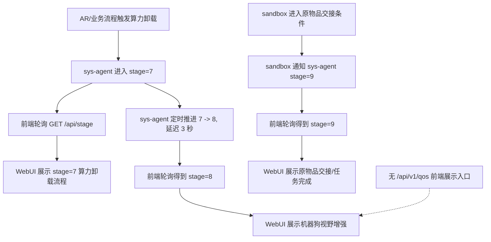
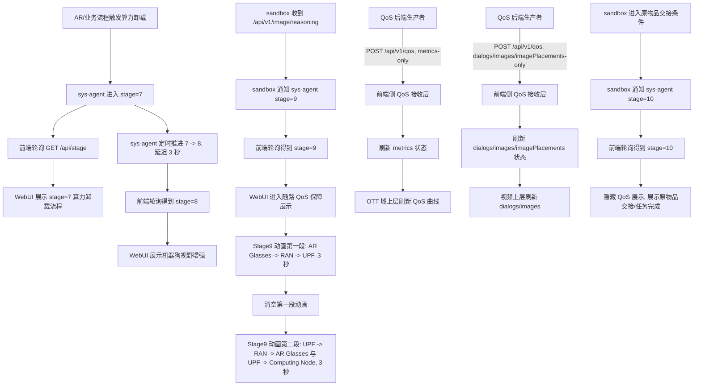
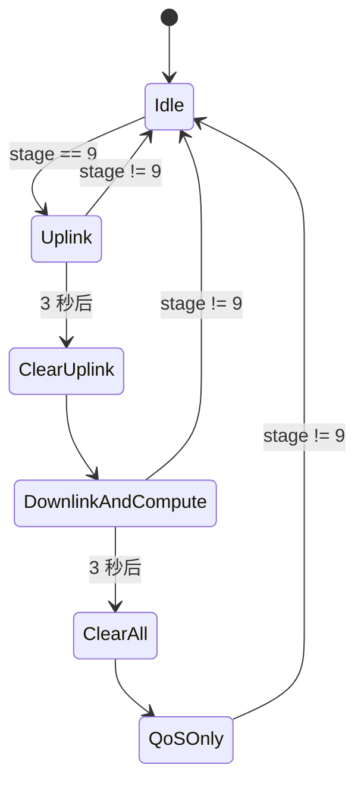
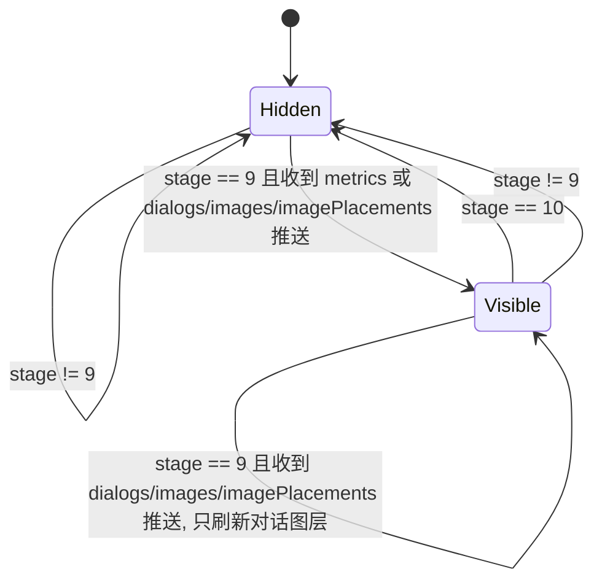

# Stage 9 随路 QoS 前端呈现设计

## 背景

当前 `compute-webui` 的演示阶段由 `/api/stage` 驱动，前端通过 `useStagePolling` 轮询阶段状态，再由 `STAGE_CONFIG`、`useEffectiveStageConfig`、`NetworkTopology3D` 和左侧视频面板共同完成展示。

现有 `stage=9` 表示“物品交接/任务完成”。新增需求要求插入一个新的 `stage=9`，表示“随路 QoS 保障用户体验”，并将原有 `stage=9` 整体顺延为 `stage=10`。

同时新增一个 QoS 数据入口：后端主动向前端侧 `POST /api/v1/qos`。QoS 数据分两类独立推送：只包含 `metrics` 的推送用于刷新图表，只包含 `dialogs`、`images` 和 `imagePlacements` 的推送用于刷新视频对话图层。前端不主动 `GET /api/v1/qos`。前端在新 `stage=9` 展示 QoS 对话、图片和指标曲线，进入 `stage=10` 后清空并隐藏这些 QoS 展示。

## 目标

- 新增 `stage=9` 页面语义：随路 QoS 保障用户体验。
- 原有 `stage=9` 的物品交接/任务完成展示变为 `stage=10`。
- 前端侧支持接收后端主动 `POST /api/v1/qos` 的 JSON 数据，页面不主动 `GET /api/v1/qos`。
- `metrics` 与 `dialogs/images` 单独发送、单独刷新。
- `dialogs` 和 `images` 按数组下标配对，以对话形式叠加在视频上方。
- 图片可按每一条 dialog/image 独立配置显示在对应对话文本上方或下方。
- `metrics` 以 `timestamp` 为横轴，绘制 `sendrate_kbps` 和 `gbr_kbps` 两条曲线。
- QoS 图表显示在拓扑图 OTT 域上层，尺寸稳定，不挤压拓扑布局。
- 进入 `stage=9` 后新增两段式拓扑流动动画，每段持续 3 秒，第二段开始时清空第一段动画。
- 一旦进入 `stage=10`，QoS 对话、图片、图表都不再显示。

## 非目标

- 不在本设计中实现 sandbox 和 sys-agent 的后端逻辑，只描述前端对接要求。
- 不改变 WebRTC offer 流程。
- 不把 `q_lvl` 作为第一版图表主曲线；第一版保留并用于质量等级标识、颜色或提示。
- 不要求浏览器页面直接作为 HTTP 服务监听 POST。浏览器无法直接接收任意后端 HTTP POST，需要由前端仓的接收层或部署宿主接收后转给页面状态。

## 推荐方案

采用“QoS POST 接收层 + 前端内部状态分发”的方案。

前端仓提供 `/api/v1/qos` 的接收契约：

- 后端生产者：`POST /api/v1/qos`
- 前端页面：不主动 `GET /api/v1/qos`
- 接收层识别两类独立 payload：
  - `metrics` payload：只更新 QoS 图表数据
  - `dialogs/images/imagePlacements` payload：只更新视频对话图层数据
- 接收层通过前端内部状态通道把更新送到页面；具体可以是同源事件通道、WebSocket/SSE、框架服务端状态注入或本地 mock 事件分发，但不使用页面主动 GET
- 页面只在 `stage=9` 启用 QoS 数据展示
- 页面进入 `stage=10` 时清空本地 QoS 状态并隐藏 UI

这个方案保留后端主动 POST 的接口语义，同时把图表刷新和对话图层刷新解耦，避免两个数据源互相覆盖。

备选方案：

- SSE：`POST /api/v1/qos` 写入接收层，再由内部事件通道推给浏览器。适合单向实时推送。
- WebSocket：适合高频指标流和双向状态确认，但第一版实现成本更高。

第一版推荐先把页面消费侧设计为“订阅式状态更新”，具体桥接方式由前端运行环境决定，但不要实现页面主动 GET。

## 改动前流程



改动前的要点：

- 前端合法 stage 为 `1, 2, 4, 5, 6, 7, 8, 9`。
- `stage=9` 已被原物品交接流程占用。
- QoS 数据没有专用前端入口，也没有视频 overlay 或 OTT 图表。
- 代码中所有 `stage === 9` 的特判默认指向原物品交接语义。

## 改动后流程



改动后的要点：

- 新增 `stage=9`：随路 QoS 保障用户体验。
- 原有 `stage=9` 整体迁移到 `stage=10`。
- sandbox 收到 `/api/v1/image/reasoning` 后通知 sys-agent 进入 `stage=9`。
- sandbox 原来通知 `stage=9` 的位置改为通知 `stage=10`。
- 前端只在 `stage=9` 展示 QoS overlay。
- 前端不主动 `GET /api/v1/qos`，只消费后端主动 POST 进入前端侧后的状态更新。
- `metrics` 推送只刷新 OTT 图表；`dialogs/images/imagePlacements` 推送只刷新视频对话层。
- 前端进入 `stage=9` 后播放两段式拓扑流动动画，每段 3 秒，阶段之间清空上一段动画。
- 进入 `stage=10` 后必须隐藏并清理 QoS UI。

## Stage 状态设计

| Stage | 改动前含义 | 改动后含义 | 前端行为 |
| --- | --- | --- | --- |
| `7` | 算力卸载流程 | 不变 | 保持现有动画和流程 |
| `8` | 机器狗视野增强 | 不变 | 保持现有增强视频展示 |
| `9` | 物品交接/任务完成 | 随路 QoS 保障用户体验 | 新增视频 QoS 对话 overlay 和 OTT QoS 图表 |
| `10` | 不存在 | 原 `stage=9` 物品交接/任务完成 | 展示原完成态，隐藏 QoS UI |

前端需要调整：

- `normalizeStage` 支持 `10`。
- `server/stage_server.py` 本地 mock 支持 `10`。
- `STAGE_CONFIG[9]` 改为 QoS 阶段。
- 原 `STAGE_CONFIG[9]` 迁移为 `STAGE_CONFIG[10]`。
- 原有 `stage === 9` 的物品交接特判迁移为 `stage === 10`。
- 原有 `stage9HandoffFlashActive`、`stage9BlinkActive` 这类变量建议改名为 `stage10HandoffFlashActive`、`stage10BlinkActive`，避免新旧语义混淆。

## QoS 接口契约

### POST /api/v1/qos

`/api/v1/qos` 只接受后端主动 POST。请求体分为两种互斥类型。

#### Metrics 推送

只包含 `metrics` 字段，用于刷新 OTT QoS 图表：

```json
{
  "metrics": [
    {
      "timestamp": 1720000000000,
      "sendrate_kbps": 920,
      "gbr_kbps": 1000,
      "q_lvl": 3
    }
  ]
}
```

处理规则：

- 收到合法 `metrics` 推送后，只刷新图表数据。
- 不改变当前视频对话图层。
- 每次 `metrics` 推送视为一份完整图表数据源，前端用最新数组重绘曲线。

#### Dialog/Image 推送

只包含 `dialogs`、`images` 和 `imagePlacements` 字段，用于刷新视频上层对话图层：

```json
{
  "dialogs": [
    "检测到视频链路波动，已启用随路 QoS 保障。",
    "保障带宽已抬升，AR 端视频体验恢复稳定。"
  ],
  "images": [
    "data:image/png;base64,...",
    "data:image/gif;base64,..."
  ],
  "imagePlacements": [
    "above",
    "below"
  ]
}
```

字段规则：

- `metrics` payload 中，`metrics` 必须是数组。
- `metrics[].timestamp` 必须是有限数字，建议毫秒时间戳。
- `metrics[].sendrate_kbps` 必须是有限数字。
- `metrics[].gbr_kbps` 必须是有限数字。
- `metrics[].q_lvl` 必须是有限数字或可转换为数字的等级值。
- `dialogs/images/imagePlacements` payload 中，`dialogs` 必须是字符串数组。
- `dialogs/images/imagePlacements` payload 中，`images` 必须是字符串数组。
- `dialogs/images/imagePlacements` payload 中，`imagePlacements` 必须是字符串数组。
- `dialogs.length` 必须等于 `images.length`。
- `imagePlacements.length` 必须等于 `dialogs.length`。
- `imagePlacements[]` 允许值为 `above` 或 `below`。
- `images[]` 支持 `data:image/png;base64,...`、`data:image/jpeg;base64,...`、`data:image/gif;base64,...` 或 `http(s)` 图片 URL。
- `metrics` 与 `dialogs/images/imagePlacements` 必须单独发送，不允许在同一个 payload 中混合。
- 混合 payload 按非法请求处理，避免出现“同时刷新图表和对话”的歧义。
- 收到合法 `dialogs/images/imagePlacements` 推送后，只刷新对话图层，默认把这次 payload 作为完整对话层快照并替换旧对话层。

建议响应：

```json
{
  "status": "SUCCESS",
  "receivedAt": 1720000001000
}
```

非法请求响应：

```json
{
  "status": "FAIL",
  "reason": "invalid_qos_payload"
}
```

### 页面消费 QoS 状态

页面不主动 `GET /api/v1/qos`。QoS 接收层收到合法 POST 后，把更新分发到页面状态：

- `metrics` 推送进入 `qosMetrics` 状态，只触发 `QosMetricsChart` 刷新。
- `dialogs/images/imagePlacements` 推送进入 `qosDialogItems` 状态，只触发 `QosDialogOverlay` 刷新。
- 两个状态互不覆盖。
- 进入非 `stage=9` 时，页面清空两个状态并取消显示。

## 前端组件设计

### Stage 9 拓扑动画

现有拓扑活动连接已经是流动式动画。`NetworkTopology3D` 中活动连接使用 `strokeDasharray` 和 `topology-flow` CSS 动画绘制流动线，支持 `reverse` 反向流动。因此新 `stage=9` 动画应复用现有流动线机制，不新增另一套视觉语言。

新增 `stage=9` 两段动画：

| 阶段 | 持续时间 | 流动路径 | 高亮节点 | 清理规则 |
| --- | --- | --- | --- | --- |
| `stage9_qos_uplink` | 3 秒 | `AR Glasses -> RAN -> UPF` | `UE`, `gNB`, `UPF` | 进入下一段前清空本段 `topologyLines`、`activeConnections`、`highlightedNodes` |
| `stage9_qos_downlink_compute` | 3 秒 | `UPF -> RAN -> AR Glasses` 与 `UPF -> Computing Node` 并行 | `UPF`, `gNB`, `UE`, `Computing` | 本段结束后清空本段动画，只保留 QoS overlay 和图表 |

路径映射建议：

- `AR Glasses -> RAN` 使用现有节点键 `UE->gNB`。
- `RAN -> UPF` 使用现有节点键 `gNB->UPF`。
- `UPF -> RAN -> AR Glasses` 使用反向连接：
  - `{ key: "UPF->gNB", pathKey: "gNB->UPF", reverse: true }`
  - `{ key: "gNB->UE", pathKey: "UE->gNB", reverse: true }`
- `UPF -> Computing Node` 如果没有现成路径键，需要新增一条 `UPF->Computing` 几何路径；如果现有拓扑无法直连，则用 `UPF -> Gateway -> Computing` 作为实现 fallback，但设计语义仍显示为 `UPF -> Computing Node`。

动画生命周期：



设计规则：

- 每段持续 3 秒。
- 第二段开始前必须清空第一段动画，不叠加残留连线。
- 第二段同时展示两路流动：一路回到 AR Glasses，一路到 Computing Node。
- 两段动画结束后，`stage=9` 仍停留在 QoS 展示态，但不再保留拓扑流动线。
- 如果 `stage=9` 期间重新收到 stage 9，不重复播放，除非后续实现显式引入动画重播 epoch。
- 进入 `stage=10` 或其他 stage 时立即清空 stage 9 动画状态。

### QoS 数据解析

新增纯函数模块，建议放在 `src/utils/qosPayloads.js`：

- `parseQosPushPayload(payload)`：识别 payload 类型并校验。
- `parseQosMetricsPayload(payload)`：校验并归一化 metrics 推送。
- `parseQosDialogImagePayload(payload)`：校验并归一化 dialogs/images/imagePlacements 推送。
- `isSupportedQosImageSource(value)`：校验图片来源。
- `buildQosDialogItems(dialogs, images, imagePlacements, defaultPlacement)`：按下标生成 UI 可消费的对话项。

解析失败不应破坏 stage 页面，只记录错误并保留对应状态的上一份有效数据或显示空态。`metrics` 解析失败不影响当前对话图层，`dialogs/images/imagePlacements` 解析失败不影响当前图表。

### QoS 推送状态订阅

新增 hook，建议放在 `src/hooks/useQosFeed.js`：

- 入参：`enabled`
- 当 `stage === 9` 时订阅 QoS 推送状态。
- 当 `stage !== 9` 时取消订阅并清空 `metrics`、`dialogItems`。
- 不主动 `fetch(GET /api/v1/qos)`。
- 返回 `{ metrics, dialogItems, error }`。

具体订阅实现可以按运行环境选择：同源事件通道、WebSocket/SSE、框架服务端注入或本地 mock 事件分发。hook 的职责是消费已经进入前端侧的 QoS 状态，而不是主动拉取接口。

### 视频上方 QoS 对话层

新增组件，建议命名为 `QosDialogOverlay`：

- 只接收已经配对好的 `items`。
- 渲染在视频容器内，使用绝对定位覆盖视频上方。
- 每条消息包含图片和文本。
- 图片上下位置由每条 item 的 `imagePlacement` 控制：
  - `above`：图片在文本上方。
  - `below`：图片在文本下方。
- `imagePlacements[i]` 对应 `images[i]` 和 `dialogs[i]`。
- 若实现需要兼容旧数据，缺失的单条配置可使用 `qosDialogDefaultImagePlacement`，默认值为 `above`；新 payload 应按每条携带 `imagePlacements`。
- 图片加载失败时保留文本气泡，不让 overlay 消失或撑破布局。

集成点：

- `DogVisionPanel` 当前已经是 `relative` 容器，适合增加 `children` 或 `overlay` prop。
- 新 `stage=9` 建议继承 `stage=8` 的机器狗增强视频展示，在增强视频上方显示 QoS 对话层。
- 如果业务明确要求叠加在原始视频而非增强视频上，后续只需调整传入 overlay 的目标 `DogVisionPanel`。

### OTT 域 QoS 图表

新增组件，建议命名为 `QosMetricsChart`：

- 输入：`metrics`。
- 横轴：`timestamp`。
- 曲线 1：`sendrate_kbps`。
- 曲线 2：`gbr_kbps`。
- 两条曲线单位相同，第一版建议共用 `kbps` 纵轴，避免双 Y 轴造成比例误读。
- `q_lvl` 不作为主曲线，建议以点颜色、角标或当前等级文案展示。
- 无数据时不渲染图表或渲染轻量空态。

集成点：

- `NetworkTopology3D` 内已有 OTT 域节点定义和绝对定位绘制层。
- QoS 图表应作为 OTT 域上层 overlay，使用固定宽高或响应式 `min/max` 约束。
- 图表不参与拓扑布局计算，避免 stage 切换时拓扑跳动。

## 配置设计

推荐新增 runtime 配置：

```js
window.__RUNTIME_CONFIG__ = {
  qosPushChannelUrl: "ws://frontend-host:28448/api/v1/qos/events",
  qosDialogDefaultImagePlacement: "above"
}
```

配置规则：

- `qosPushChannelUrl` 只在页面需要显式订阅事件通道时使用；如果运行环境可以直接注入 QoS 状态，可不配置。
- `qosDialogDefaultImagePlacement` 允许值为 `above` 或 `below`，只作为缺失单条配置时的兜底。
- 未配置时：
  - 页面不主动请求 `/api/v1/qos`。
  - `qosDialogDefaultImagePlacement` 默认为 `above`。

由于 POST 发送方不由前端控制，后端只需要按照部署给出的前端接收地址发送 `POST /api/v1/qos` 即可。浏览器 runtime config 不负责声明后端 POST 目标。

## 显示生命周期



生命周期规则：

- `stage=9` 前：不显示 QoS overlay。
- 进入 `stage=9`：启用 QoS 推送状态订阅，收到有效推送后显示对应 UI。
- `stage=9` 中：`metrics` 推送只替换图表数据，`dialogs/images/imagePlacements` 推送只替换对话图层数据。
- 进入 `stage=10`：立即清空并隐藏 QoS 对话和图表。
- 进入其他 stage：同样清空并隐藏 QoS 对话和图表。

## 错误处理

- QoS POST JSON 无法解析：返回 `400`，不更新任何 QoS 状态。
- 同时包含 `metrics` 和 `dialogs/images/imagePlacements` 的混合 payload：返回 `400`，不更新任何 QoS 状态。
- `metrics` payload 非法：返回 `400`，不更新图表，不影响当前对话图层。
- `dialogs.length !== images.length`：返回 `400`，不更新对话图层，不影响当前图表。
- `imagePlacements.length !== dialogs.length`：返回 `400`，不更新对话图层，不影响当前图表。
- `imagePlacements[]` 包含非 `above`/`below` 值：返回 `400`，不更新对话图层，不影响当前图表。
- 图片来源不是允许的 data URI 或 `http(s)` URL：返回 `400`，不更新对话图层，不影响当前图表。
- 单张图片加载失败：前端隐藏该图片，只显示对应 dialog。
- `metrics` 中存在非法点：解析层可丢弃非法点；如果全部非法，则图表不显示。
- QoS 推送状态通道异常：不影响 stage 展示，只保留错误状态供调试。
- `stage=10` 时即使 QoS 接收层仍收到 POST，页面也不显示。

## 需要关注的现有代码点

确定需要调整：

- `src/config/runtimeUrls.js`
  - `normalizeStage` 支持 `10`。
  - 不新增用于主动 GET `/api/v1/qos` 的 URL helper。
  - 如需要浏览器订阅事件通道，可新增 `getQosPushChannelUrl`。
- `src/utils/pollingPayloads.js` 或新 `src/utils/qosPayloads.js`
  - 增加 metrics payload 和 dialogs/images/imagePlacements payload 的互斥解析和校验。
- `src/hooks/useQosFeed.js`
  - 增加 QoS 推送状态订阅 hook。
  - 禁止在该 hook 中主动 `GET /api/v1/qos`。
- `src/config/stageConfig.jsx`
  - 新增 `STAGE_CONFIG[9]`。
  - 新增 `STAGE9_QOS_PHASES`，包含两段 3 秒动画配置。
  - 原 `STAGE_CONFIG[9]` 迁移为 `STAGE_CONFIG[10]`。
  - 原 `STAGE9_COMPLETED_TASKS` 建议迁移为 `STAGE10_COMPLETED_TASKS`。
- `src/hooks/useEffectiveStageConfig.js`
  - 新增 stage 9 phase index/timer 状态，每段 3 秒推进。
  - 每段 phase 切换时只暴露当前段的 `topologyLines`、`activeConnections`、`highlightedNodes`。
  - 将原 stage 9 物品交接动画状态迁移到 stage 10。
  - 新 stage 9 不复用原 handoff flash。
- `src/App.jsx`
  - 接入 `useQosFeed(stage === 9)`。
  - 将 QoS overlay 数据传给左侧视频面板和拓扑图。
  - `topologyAgentBubble` 中原 `stage === 9 ? null` 需要改为新语义判断。
- `src/components/NetworkTopology3D.jsx`
  - 新增 OTT 上层 `QosMetricsChart` 挂载点。
  - 复用现有 `topology-flow` 流动线动画绘制 stage 9 QoS 链路。
  - 如当前路径表不支持 `UPF->Computing`，补充对应几何路径或 connector point。
  - 原 stage 9 handoff blink 逻辑迁移到 stage 10。
- `src/components/DemoPanels.jsx`
  - `DogVisionPanel` 支持 overlay。
  - 遗留 `RightPanel` 中 `stage === 9` 完成态判断迁移为 `stage === 10`。
- `server/stage_server.py`
  - 本地 mock stage 支持 `10`。
  - 增加 `POST /api/v1/qos` 接收能力。
  - 本地联调如需页面实时刷新，应通过事件通道或 mock 状态分发，不通过 `GET /api/v1/qos`。

需要同步更新文档和测试：

- `docs/mock-webui-whitebox-reliability.md`
  - 合法 stage 列表扩展到 `10`。
  - “Stage 9 handoff” 描述改为 “Stage 10 handoff”。
- `test/runtimeUrls.test.js`
  - `normalizeStage(10)` 应返回 `10`。
  - 如新增 `getQosPushChannelUrl`，覆盖 runtime config。
- `test/pollingPayloads.test.js` 或新 `test/qosPayloads.test.js`
  - 覆盖 metrics-only payload 校验。
  - 覆盖 dialogs/images/imagePlacements-only payload 校验。
  - 覆盖混合 payload 拒绝、图片来源、dialogs/images/imagePlacements 数量一致性和位置枚举值。
- `test/topologySummary.test.js`
  - 原 idle Stage 9 相关测试迁移到 Stage 10。

## 验收标准

- 前端可识别 `stage=10`。
- 新 `stage=9` 不显示原物品交接完成态。
- 原物品交接完成态在 `stage=10` 显示。
- 前端页面不主动 `GET /api/v1/qos`。
- 向前端侧 `POST /api/v1/qos` 且 payload 只包含 `metrics` 后，`stage=9` 页面只刷新 QoS 图表，不改变对话图层。
- 向前端侧 `POST /api/v1/qos` 且 payload 只包含 `dialogs/images/imagePlacements` 后，`stage=9` 页面只刷新对话文本和对应图片，不改变 QoS 图表。
- 每条对话的图片位置由 `imagePlacements[i]` 单独决定。
- 同一个 QoS payload 同时包含 `metrics` 和 `dialogs/images/imagePlacements` 时按非法请求处理。
- 进入 `stage=9` 后，先播放 `AR Glasses -> RAN -> UPF` 流动动画，持续 3 秒。
- 第一段结束时，第一段动画连线和高亮被清空。
- 第二段播放 `UPF -> RAN -> AR Glasses` 与 `UPF -> Computing Node` 并行流动动画，持续 3 秒。
- 第二段结束后，拓扑流动动画清空，只保留 QoS overlay 和图表。
- 图片位置可通过逐条配置在对应 dialog 上方或下方切换。
- QoS 图表固定在 OTT 域上层，不改变拓扑布局尺寸。
- 进入 `stage=10` 后，QoS 对话和图表立即隐藏。
- 非 `stage=9` 时 QoS 数据不会泄露显示。
- `npm test`、`npm run build`、`git diff --check` 通过。

## 实施顺序建议

1. 更新 stage 合法值和本地 mock server。
2. 迁移原 `stage=9` 到 `stage=10`，消除旧语义特判。
3. 新增 stage 9 两段式 QoS 拓扑动画配置和 phase 计时逻辑。
4. 新增 metrics-only 与 dialogs/images/imagePlacements-only QoS payload 解析和测试。
5. 新增 QoS POST 接收层本地 mock，按 payload 类型分发状态。
6. 新增 `useQosFeed` 推送状态订阅，不做 GET 轮询。
7. 新增视频 QoS 对话 overlay。
8. 新增 OTT QoS 图表 overlay。
9. 接入 `App.jsx`，按 stage 控制显示生命周期。
10. 更新文档和测试。
11. 运行验证并提交实现。
